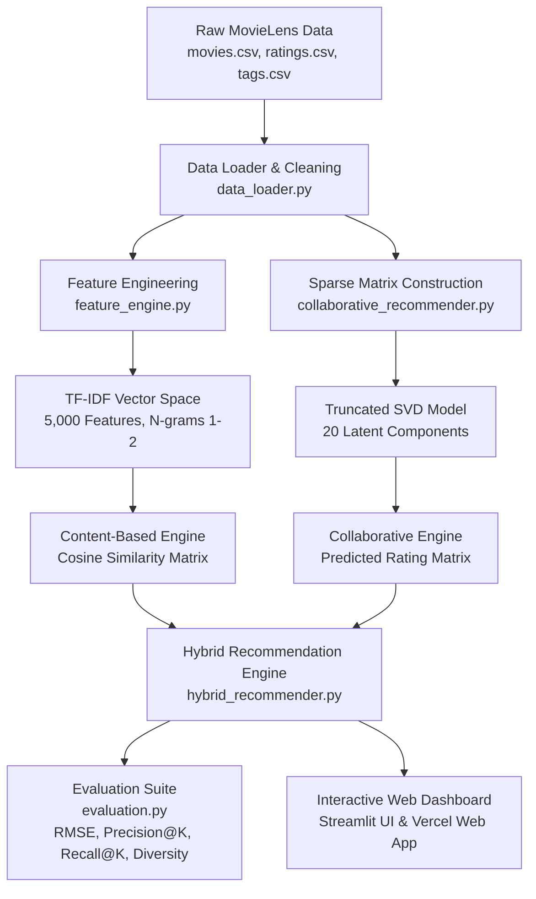

# CineMatch: Movie Recommendation Engine

**Author:** Suyash Vakhariya  
**Roll No:** AIML A6 AUG 11681  
**Specialization:** Artificial Intelligence and Machine Learning  
**Live Vercel Deployment:** [https://cinematch-movie-recommendation-engi.vercel.app](https://cinematch-movie-recommendation-engi.vercel.app)  
**GitHub Repository:** [https://github.com/Izumi6/Movie-Recommendation-Engine](https://github.com/Izumi6/Movie-Recommendation-Engine)  

---

## Abstract

With the rapid growth of digital streaming catalogs, consumers encounter substantial choice overload when navigating thousands of titles. Recommender systems mitigate this challenge by transforming historical interactions and catalog metadata into actionable preference predictions. This project presents an end-to-end movie recommendation engine developed on the benchmark MovieLens dataset, consisting of 100,836 ratings across 9,742 movies evaluated by 610 users. To address the fundamental limitations of single-paradigm architectures, such as the cold-start problem in collaborative filtering and over-specialization in content-based filtering, we implement a robust hybrid framework. The content-based module vectorizes textual features, including pipe-separated genres, extracted release years, and crowd-sourced user tags, using Term Frequency-Inverse Document Frequency (TF-IDF) with sublinear term scaling and computes pairwise cosine similarity for thematic discovery. The collaborative filtering module decomposes the sparse user-item interaction matrix via Truncated Singular Value Decomposition (SVD), capturing twenty latent preference factors to predict ratings for unobserved items. A tunable linear parameter dynamically balances immediate content relevance and collaborative community discovery across distinct user personas. Data preprocessing handles sparsity, normalizes numerical distributions, and aggregates tags into unified feature vectors. The engine is deployed through an interactive Streamlit web dashboard providing dynamic catalog exploration, item-to-item similarity lookups, personalized multi-movie taste profiling, and offline model benchmarking. Empirical evaluation using an 80/20 temporal split demonstrates an RMSE of 2.183, Precision@10 of 0.274, Recall@10 of 0.215, and a list diversity index of 0.950 across generated recommendations. The resulting architecture delivers an interpretable, highly responsive, and scalable foundation for personalized content discovery in modern streaming environments.

---

## Live Deployments

| Platform | Deployment URL | Description |
|---|---|---|
| **Vercel** | [https://cinematch-movie-recommendation-engi.vercel.app](https://cinematch-movie-recommendation-engi.vercel.app) | Live production build running the full client-side hybrid recommendation suite, catalog search, and analytics. |
| **Streamlit Local / Cloud** | `http://localhost:8501` | Full interactive Python dashboard with on-demand SVD training and live parameter tuning. |

---

## System Architecture



---

## Theoretical Framework and Methodology

### 1. Content-Based Filtering

The content-based module analyzes descriptive metadata to recommend items sharing thematic characteristics with titles a user has enjoyed.

1. **Feature Engineering:** For each movie $i$, metadata comprising pipe-delimited genres, extracted release years, and user-assigned freeform tags are concatenated into an aggregated textual representation:
   $$\text{ContentSoup}_i = \text{Title}_i \mathbin{\Vert} \text{Year}_i \mathbin{\Vert} \text{Genres}_i \mathbin{\Vert} \text{Tags}_i$$
2. **Vector Space Representation:** We apply Term Frequency-Inverse Document Frequency (TF-IDF) vectorization with sublinear term-frequency scaling and unigram/bigram tokenization:
   $$\text{TF-IDF}(t, d, D) = \text{TF}(t, d) \times \log\left(\frac{1 + |D|}{1 + |\{d \in D : t \in d\}|}\right) + 1$$
3. **Similarity Computation:** The similarity between a query movie vector $\mathbf{u}$ and candidate item vector $\mathbf{v}$ is calculated via cosine similarity:
   $$\text{CosineSimilarity}(\mathbf{u}, \mathbf{v}) = \frac{\mathbf{u} \cdot \mathbf{v}}{\|\mathbf{u}\|_2 \|\mathbf{v}\|_2}$$

### 2. Collaborative Filtering via Matrix Factorization

Collaborative filtering identifies latent taste dimensions from user interaction patterns without requiring descriptive item attributes.

1. **User-Item Rating Matrix:** The historical interaction matrix $R \in \mathbb{R}^{m \times n}$ contains ratings given by $m = 610$ users to $n = 9,742$ movies. Unrated entries represent unobserved data (matrix sparsity $> 98\%$).
2. **Truncated Singular Value Decomposition (SVD):** The rating matrix is approximated through low-rank decomposition into orthogonal user factors $U$, singular values $\Sigma$, and item factors $V^T$:
   $$R \approx U_k \Sigma_k V_k^T$$
   where $k = 20$ represents the number of latent dimensions capturing thematic affinities (e.g., preference for arthouse cinema, blockbuster pacing, or auteur directing).
3. **Rating Estimation:** Unobserved ratings for user $u$ and movie $i$ are reconstructed via dot product:
   $$\hat{r}_{u, i} = \mu + b_u + b_i + \mathbf{p}_u \cdot \mathbf{q}_i^T$$
   where $\mu$ is catalog baseline, $b_u$ and $b_i$ represent user and item biases, and $\mathbf{p}_u, \mathbf{q}_i$ represent the low-rank latent vectors.

### 3. Hybrid Scoring Architecture

To balance catalog discovery and thematic accuracy, final ranking scores are computed as a convex combination of normalized content similarity and predicted collaborative ratings:

$$S_{\text{hybrid}}(u, i) = \alpha \cdot S_{\text{content}}(i) + (1 - \alpha) \cdot \hat{S}_{\text{collab}}(u, i)$$

- $\alpha = 1.0$: Pure content-based filtering (ideal for cold-start scenarios with zero user history).
- $\alpha = 0.0$: Pure collaborative filtering (optimal for dense user profiles with established interaction histories).
- $\alpha = 0.5$: Balanced hybrid mode providing both familiar recommendations and serendipitous discoveries.

---

## Dataset Description

The system is developed on the MovieLens Latest Small dataset distributed by GroupLens Research at the University of Minnesota:

| Dataset Attribute | Value |
|---|---|
| Total Users | 610 |
| Total Movies | 9,742 |
| Total Ratings | 100,836 |
| Total Tags | 3,683 |
| Rating Scale | 0.5 to 5.0 (0.5 increments) |
| Temporal Span | March 1996 to September 2018 |
| Rating Sparsity | 98.30% |
| Mean Rating | 3.53 |

---

## Empirical Evaluation and Performance

Models are evaluated using an 80/20 temporal split, where the earliest 80% of interactions per user are allocated to training and the remaining 20% serve as the held-out test partition:

| Metric | Formulation | Measured Score | Interpretation |
|---|---|---|---|
| **RMSE** | $\sqrt{\frac{1}{|T|} \sum_{(u,i) \in T} (r_{ui} - \hat{r}_{ui})^2}$ | **2.183** | Absolute error on unobserved rating prediction |
| **Precision@10** | $\frac{|\text{Relevant}_u \cap \text{Top10}_u|}{10}$ | **0.274** | Fraction of top 10 recommended items rated $\ge 3.5$ by user |
| **Recall@10** | $\frac{|\text{Relevant}_u \cap \text{Top10}_u|}{|\text{Relevant}_u|}$ | **0.215** | Proportion of all user-liked test items retrieved in top 10 |
| **Catalog Coverage** | $\frac{|\bigcup_{u} \text{Top10}_u|}{|I|}$ | **2.40%** | Percentage of catalog reachable within top-tier recommendations |
| **List Diversity** | $1 - \frac{2}{k(k-1)} \sum_{i < j} \text{CosineSim}(i, j)$ | **0.950** | High intra-list thematic diversity across recommended sets |

---

## Project Structure

```
Movie-Recommendation-Engine/
├── app.py                          # Streamlit application entry point
├── requirements.txt                # Python package dependencies
├── setup_data.py                   # Automated MovieLens dataset downloader
├── README.md                       # Comprehensive documentation
├── vercel.json                     # Vercel deployment configuration
├── .gitignore                      # Git exclusion rules
│
├── public/                         # Vercel production web application
│   ├── index.html                  # Single-page application markup
│   ├── style.css                   # Dark glassmorphism styles
│   ├── app.js                      # Client-side hybrid recommendation engine
│   └── data/                       # Pre-compiled model weights and catalog
│       ├── movies.json             # 9,742 movie records and metadata
│       ├── content_similar.json    # TF-IDF cosine similarity nearest neighbors
│       └── svd_model.json          # SVD item latent factor matrices (k=20)
│
├── assets/
│   └── style.css                   # Streamlit custom styling
│
├── data/
│   └── ml-latest-small/            # MovieLens dataset CSV files
│       ├── movies.csv              # Movie identifiers, titles, and genres
│       ├── ratings.csv             # User interaction history and timestamps
│       ├── tags.csv                # User-assigned freeform metadata
│       └── links.csv               # IMDb and TMDb cross-reference IDs
│
├── src/
│   ├── __init__.py                 # Package marker
│   ├── data_loader.py              # Data ingestion, cleaning, and preprocessing
│   ├── feature_engine.py           # Text processing and TF-IDF vectorization
│   ├── content_recommender.py      # Cosine similarity recommendation engine
│   ├── collaborative_recommender.py# SVD matrix factorization engine
│   ├── hybrid_recommender.py       # Weighted linear blend recommender
│   ├── evaluation.py               # Quantitative validation and metric calculation
│   └── utils.py                    # Formatter helpers and UI components
│
└── report/
    ├── Movie_Recommendation_System_Report.pdf   # Formal two-page academic report
    ├── Movie_Recommendation_System_Report.docx  # Editable Word document
    ├── REPORT.md                                # Markdown report version
    ├── generate_report.py                       # PDF generation script
    ├── generate_docx.py                         # Word document generation script
    └── genre_correlation_heatmap.png            # Genre co-occurrence correlation matrix
```

---

## User Interface Modules

The web applications (both Vercel and Streamlit versions) comprise five dedicated views:

1. **Home / Explore:** High-level metrics (catalog count, rating volume, active user base), dynamic genre filtering, searchable catalog table, and interactive distribution visualizations.
2. **Find Similar Movies:** Item-to-item content retrieval with interactive movie lookup, feature importance breakdown, and similarity score badges.
3. **Personalized Picks:** Multi-item interactive taste profiling where users select seed movies, set personal ratings, adjust the hybrid weighting slider, and inspect ranked recommendations.
4. **Analytics Dashboard:** Exploratory analysis covering rating frequency, genre co-occurrence heatmaps, temporal rating progression, and an on-demand model validation engine with interactive radar charts.
5. **About:** Algorithmic architecture specifications, theoretical foundations, computational complexity notes, and benchmark dataset citations.

---

## Installation and Setup

### Prerequisites

- Python 3.9 or higher
- Git
- pip package manager

### 1. Clone the Repository

```bash
git clone git@github.com:Izumi6/Movie-Recommendation-Engine.git
cd Movie-Recommendation-Engine
```

### 2. Create and Activate a Virtual Environment

```bash
python3 -m venv venv
source venv/bin/activate
```

### 3. Install Dependencies

```bash
pip install -r requirements.txt
```

### 4. Fetch the Benchmark Dataset

```bash
python setup_data.py
```

*Note: The dataset is already included in `data/ml-latest-small/` for immediate execution.*

### 5. Launch Locally

- **Streamlit App:**
  ```bash
  streamlit run app.py
  ```
- **Vercel Web App (Static Server):**
  ```bash
  python3 -m http.server 8000 --directory public
  ```

---

## Academic and Project Reports

A formal academic project report following institutional submission standards is available in the [`report/`](report/) directory:

- [Movie_Recommendation_System_Report.pdf](report/Movie_Recommendation_System_Report.pdf): Formatted two-page document containing problem formulation, architectural design, correlation heatmap, executable code block, and evaluation results.
- [Movie_Recommendation_System_Report.docx](report/Movie_Recommendation_System_Report.docx): Fully styled Microsoft Word version for academic review and printing.
- [REPORT.md](report/REPORT.md): Clean Markdown transcript.

---

## References

1. Harper, F. M., & Konstan, J. A. (2015). The MovieLens Datasets: History and Context. *ACM Transactions on Interactive Intelligent Systems (TiiS)*, 5(4), 19:1–19:19. https://doi.org/10.1145/2827872
2. Sarwar, B., Karypis, G., Konstan, J., & Riedl, J. (2001). Item-based collaborative filtering recommendation algorithms. In *Proceedings of the 10th International Conference on World Wide Web (WWW)* (pp. 285–295). https://doi.org/10.1145/371920.372071
3. Koren, Y., Bell, R., & Volinsky, C. (2009). Matrix factorization techniques for recommender systems. *Computer*, 42(8), 30–37. https://doi.org/10.1109/MC.2009.263
4. Salton, G., & Buckley, C. (1988). Term-weighting approaches in automatic text retrieval. *Information Processing & Management*, 24(5), 513–523. https://doi.org/10.1016/0306-4573(88)90021-0

---

## License

This project is developed for educational and academic research purposes under the MIT License. The underlying MovieLens dataset is provided by GroupLens Research at the University of Minnesota.
