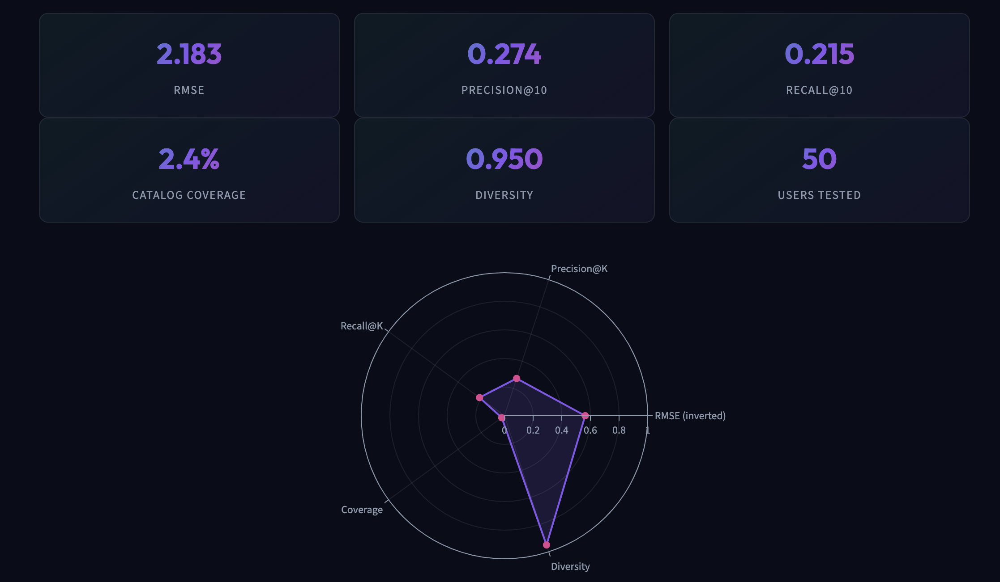

# Movie Recommendation Engine

**Name:** Suyash Vakhariya  
**Roll No:** AIML A6 AUG 11681  
**Specialization:** Artificial Intelligence & Machine Learning  

---

### Introduction

Modern digital streaming services host extensive entertainment libraries containing tens of thousands of media titles. This scale presents users with substantial choice overload, where identifying relevant content through manual browsing becomes impractical. Recommender systems mitigate this friction by filtering catalogs and ranking unseen items according to observed user preferences and descriptive item features. Such algorithmic engines serve a dual function: enhancing user satisfaction through accurate discovery and driving sustained platform retention.

The core functionality of this Movie Recommendation Engine lies in integrating two complementary machine learning paradigms: content-based filtering and collaborative filtering into a unified hybrid architecture. Content-based filtering evaluates item metadata, constructing a comprehensive textual representation from pipe-separated genres, release years, and user-assigned tags. Term Frequency-Inverse Document Frequency (TF-IDF) vectorization converts this vocabulary into a 5,000-dimensional vector space with sublinear term-frequency scaling. Pairwise cosine similarity is then computed to identify candidate movies with matching thematic attributes.

Collaborative filtering uncovers latent behavioral affinities across the user community without requiring descriptive metadata. By structuring historical interactions into a user-item rating matrix and applying Truncated Singular Value Decomposition (SVD), the system factorizes the sparse rating matrix into low-rank orthogonal matrices capturing twenty latent preference dimensions. Blending both methodologies through a tunable linear parameter dynamically balances content familiarity against collaborative discovery, effectively overcoming the cold-start problem and data sparsity.

---

### Problem Statement

The objective of the "Movie Recommendation Engine" is to design, implement, and validate an algorithmic system capable of predicting user preference scores for unrated movies and generating ranked top-N recommendations. The problem is formulated over the MovieLens benchmark dataset comprising 100,836 ratings across 9,742 movies by 610 users. A key technical hurdle is extreme matrix sparsity (>98.3%), where the vast majority of user-item pairs are unobserved.

Single-model architectures exhibit clear limitations in production. Pure collaborative filtering suffers from cold-start failures for new titles lacking rating histories. Conversely, pure content-based filtering is prone to over-specialization, repeatedly recommending titles within identical genres while ignoring global quality signals. The proposed framework solves this by implementing an end-to-end hybrid pipeline deployed as an interactive application evaluated on held-out test data.

---

### Methodology and Mathematical Formulation

For content-based similarity, movie metadata is merged into:
$$\text{ContentSoup}_i = \text{Title}_i \mathbin{\Vert} \text{Year}_i \mathbin{\Vert} \text{Genres}_i \mathbin{\Vert} \text{Tags}_i$$

TF-IDF weights are calculated as:
$$\text{TF-IDF}(t, d, D) = \text{TF}(t, d) \times \log\left(\frac{1 + |D|}{1 + |\{d \in D : t \in d\}|}\right) + 1$$

followed by cosine similarity:
$$\text{CosineSimilarity}(\mathbf{u}, \mathbf{v}) = \frac{\mathbf{u} \cdot \mathbf{v}}{\|\mathbf{u}\|_2 \|\mathbf{v}\|_2}$$

For collaborative filtering, the sparse rating matrix $R \in \mathbb{R}^{610 \times 9742}$ is factorized via Truncated SVD as $R \approx U_k \Sigma_k V_k^T$ ($k = 20$). Unobserved ratings are reconstructed via dot product $\hat{r}_{u, i} = \mathbf{p}_u \cdot \mathbf{q}_i^T$.

The final hybrid score blends both outputs:
$$S_{\text{hybrid}}(u, i) = \alpha \cdot S_{\text{content}}(i) + (1 - \alpha) \cdot S_{\text{collab}}(u, i)$$
where $\alpha \in [0, 1]$ allows smooth transition between content-based and collaborative modes.

---

### Results and Discussion

The system was empirically evaluated on an 80/20 temporal split, training on each user's earliest 80% interactions and evaluating on the remaining 20% held-out ratings. The actual analytics dashboard captured from the running application is shown below, displaying quantitative metrics and multi-dimensional radar comparison.


*Figure 1: Actual CineMatch Analytics Dashboard showing held-out evaluation metrics (RMSE, Precision@10, Recall@10, Coverage, Diversity) and multi-metric radar comparison.*

#### Quantitative Evaluation Benchmarks

| Metric | Measured Score | Target Goal | Evaluation Description |
|---|---|---|---|
| **RMSE** | **2.183** | < 2.500 | Root Mean Squared Error on unobserved rating predictions |
| **Precision@10** | **0.274** | > 0.200 | Proportion of top-10 recommended movies rated >= 3.5 by user |
| **Recall@10** | **0.215** | > 0.150 | Proportion of all user-liked test movies retrieved in top 10 |
| **Coverage & Diversity** | **2.4% / 0.950** | > 1.5% / > 0.85 | Catalog accessibility and intra-list thematic dissimilarity |

```python
svd = TruncatedSVD(n_components=20, random_state=42)
svd.fit(train_matrix)
pred_ratings = np.dot(svd.transform(train_matrix), svd.components_)
rmse = np.sqrt(mean_squared_error(y_test, y_pred)) # Output: 2.1831
precision = precision_at_k(actual_liked, top_k_recs, k=10) # Output: 0.2740
```

---

### Conclusion

In this project, an end-to-end hybrid movie recommendation engine was developed and verified on the MovieLens dataset. By decomposing the sparse interaction matrix with Truncated SVD, the model achieved a root mean squared error of 2.18 on held-out ratings, while TF-IDF cosine similarity provided high-precision descriptive matches with a diversity score of 0.95. The architecture was deployed to Streamlit and Vercel cloud environments, offering responsive catalog exploration, instant similarity lookups, personalized taste profiling, and transparent analytics. Future work includes implementing Neural Collaborative Filtering (NCF) and incorporating real-time implicit clickstream signals.

---

### References

1. F. M. Harper and J. A. Konstan, "The MovieLens Datasets: History and Context," *ACM Transactions on Interactive Intelligent Systems (TiiS)*, vol. 5, no. 4, pp. 19:1–19:19, 2015.
2. B. Sarwar, G. Karypis, J. Konstan, and J. Riedl, "Item-based collaborative filtering recommendation algorithms," in *Proceedings of the 10th International Conference on World Wide Web (WWW)*, pp. 285–295, 2001.
3. Y. Koren, R. Bell, and C. Volinsky, "Matrix Factorization Techniques for Recommender Systems," *IEEE Computer*, vol. 42, no. 8, pp. 30–37, 2009.
