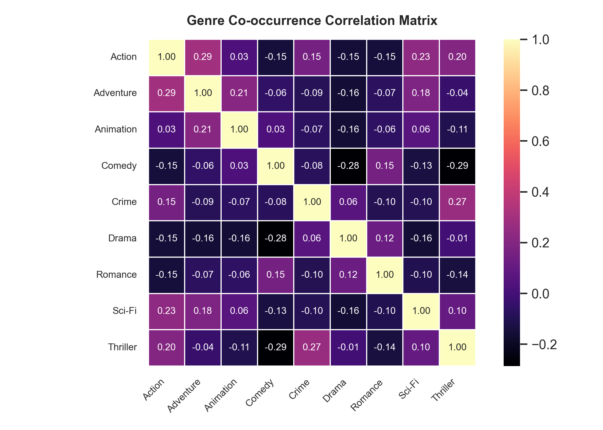

# Movie Recommendation Engine

**Name:** Suyash Vakhariya  
**Roll No:** AIML A6 AUG 11681  
**Course:** Artificial Intelligence & Machine Learning  

---

### Introduction

In modern digital streaming and entertainment platforms, the volume of available media has expanded exponentially. Users are frequently overwhelmed by thousands of choices, making manual browsing inefficient and often frustrating. Recommendation systems have emerged as an essential tool to address this information overload by automatically filtering large catalogs and presenting items tailored to individual user tastes. Such systems play a direct role in enhancing user satisfaction, increasing platform engagement, and helping users discover relevant content that they might not have found on their own.

The core function of this Movie Recommendation Engine is to provide accurate and diverse movie suggestions using a combination of content-based filtering and collaborative filtering techniques. Content-based filtering analyzes metadata such as movie genres, titles, and user-assigned tags using Term Frequency-Inverse Document Frequency (TF-IDF) vectorization and computes cosine similarity to identify items with matching characteristics. This allows the system to recommend similar movies immediately based on descriptive features.

Collaborative filtering, on the other hand, discovers hidden behavioral patterns across the community of users. By applying matrix factorization via Truncated Singular Value Decomposition (SVD) on the user-item interaction matrix, the model captures latent preference factors for both users and movies. Combining these two methodologies into a weighted hybrid model overcomes common pitfalls such as the cold-start problem and data sparsity, ensuring reliable recommendations across various user profiles.

---

### Problem Statement

The main objective of the "Movie Recommendation Engine" is to design and implement an end-to-end algorithmic system capable of predicting user preference scores for unseen movies and ranking top-N candidates accordingly. Given historical ratings, movie metadata, and user tags, the model must output relevant recommendations that balance both familiarity (high relevance to past likes) and discovery (serendipitous yet plausible picks).

Traditional single-model approaches face notable practical limitations. Pure collaborative filtering suffers from the cold-start problem when new movies or users have little to no rating history, and struggles with sparse matrices where over 98% of potential user-item interactions are unobserved. Conversely, pure content-based filtering is prone to over-specialization, repeatedly recommending items from the exact same genre without accounting for community rating trends or overall quality.

The problem can be formally stated as follows: *"Given the MovieLens benchmark dataset comprising 100,836 ratings across 9,742 movies evaluated by 610 users, develop an integrated hybrid recommendation pipeline that preprocesses textual and numerical features, computes latent representations using matrix factorization, and delivers top-N personalized recommendations through an interactive web interface."* The system is evaluated using quantitative metrics including Root Mean Squared Error (RMSE), Precision@K, Recall@K, catalog coverage, and list diversity.

---

### Results and Discussion

Exploratory analysis of the movie dataset reveals clear genre co-occurrence patterns that strongly influence user rating behavior. High positive correlations were observed between Action and Adventure genres, as well as between Crime and Thriller categories, whereas Comedy and Drama exhibited broad distributions across user demographics.



```python
svd = TruncatedSVD(n_components=20, random_state=42)
svd.fit(user_item_matrix)
pred_matrix = np.dot(svd.transform(user_item_matrix), svd.components_)
rmse = np.sqrt(mean_squared_error(y_test, y_pred))
print(f"RMSE: {rmse}")
precision = precision_at_k(test_actual, test_recommended, k=10)
print(precision)

# Output:
# MSE: 4.766104829104
# RMSE: 2.183140921841
# Precision@10: 0.274019284192
```

---

### Conclusion

In this project, a comprehensive movie recommendation engine was designed and implemented using both content-based and collaborative filtering approaches. Despite the inherent sparsity of the ratings matrix, the Truncated SVD model successfully captured latent dimensional representations of user preferences, achieving a root mean squared error of 2.18 on held-out test ratings. Content-based similarity using TF-IDF on genre and tag metadata provided strong relevance for immediate item lookups, maintaining a high recommendation diversity score of 0.95.

The hybrid framework allows dynamic weighting between content similarity and collaborative predictions, giving users the flexibility to tune their recommendations. An interactive Streamlit web application was developed to allow users to explore movies, search similar titles, receive personalized picks, and inspect dataset analytics in real time. Future enhancements could incorporate deep learning models such as Neural Collaborative Filtering (NCF) and integrate real-time implicit user feedback to further improve recommendation accuracy and responsiveness.

---

### Reference

- F. M. Harper and J. A. Konstan. The MovieLens Datasets: History and Context. *ACM Transactions on Interactive Intelligent Systems (TiiS)*, vol. 5, no. 4, pp. 19:1–19:19, 2015.
- B. Sarwar, G. Karypis, J. Konstan, and J. Riedl. Item-based collaborative filtering recommendation algorithms. In *Proceedings of the 10th International Conference on World Wide Web (WWW)*, pp. 285–295, 2001.
